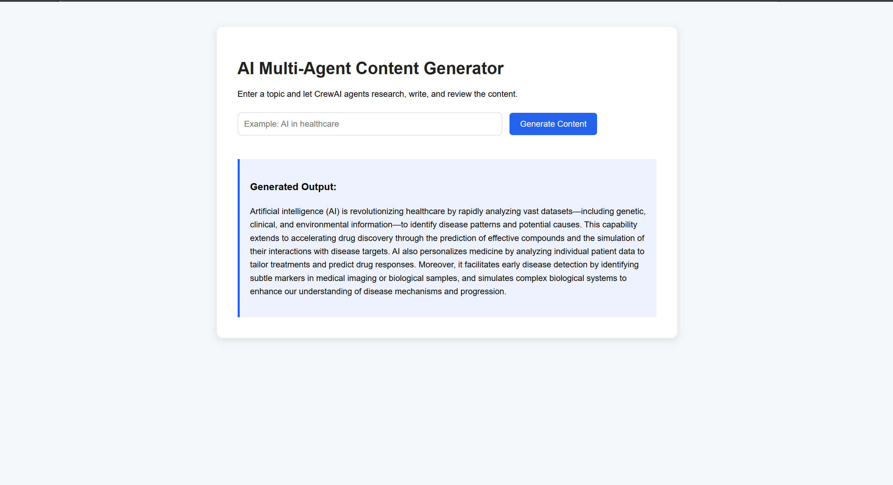

# AI Multi-Agent Content Generator

A Flask-based web application that generates structured content using a multi-agent AI workflow.
The project simulates how different AI stages can collaborate to research, write, and review content before generating a final output.

## Overview

This project was created to explore how AI workflows can be divided into smaller task-specific stages instead of relying on a single prompt.
The application processes user input through multiple AI stages:
- Research
- Writing
- Review
This helps produce cleaner and more structured content.

---

## How This Project Helped Me

This project helped me understand how AI workflows can be structured into smaller task-specific stages instead of handling everything in a single prompt.
While building this project, I improved my understanding of:

- Flask backend development
- API integration using Gemini API
- Prompt structuring and response handling
- Managing application flow between multiple AI stages
- Environment configuration using dotenv
- Building and organizing a complete project from scratch

It also gave me hands-on experience in connecting frontend interaction with backend AI processing.

---

## Features




---

## Workflow

```text
User Input
   ↓
Research Agent
   ↓
Writing Agent
   ↓
Review Agent
   ↓
Final Output
